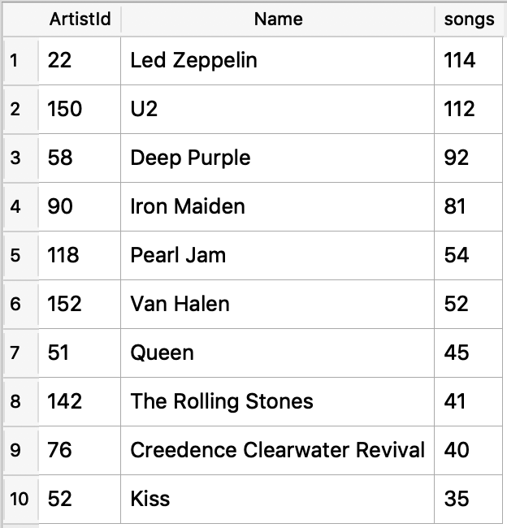
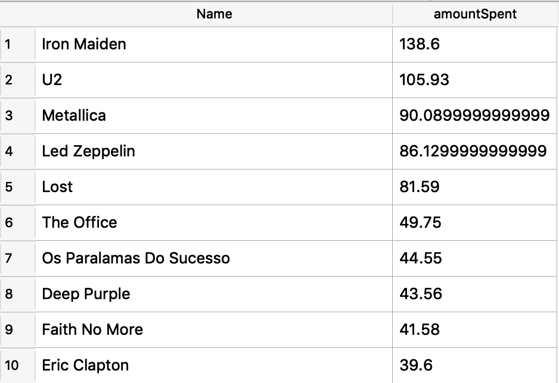
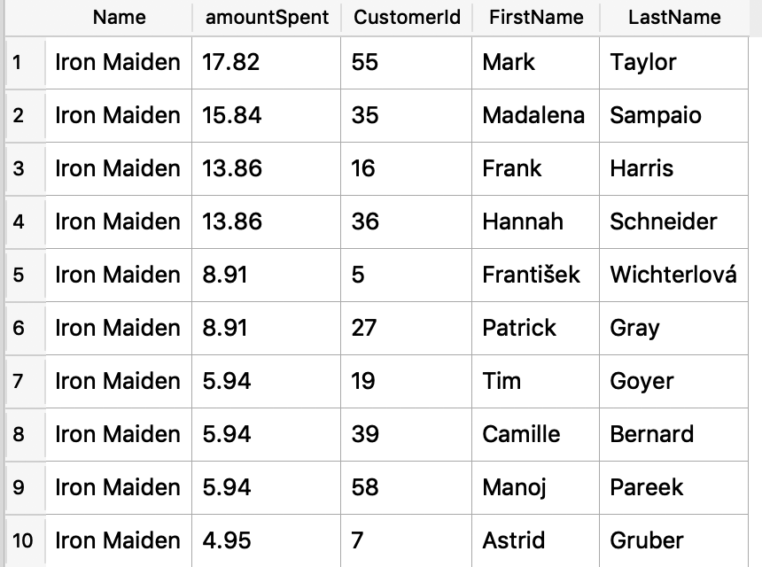
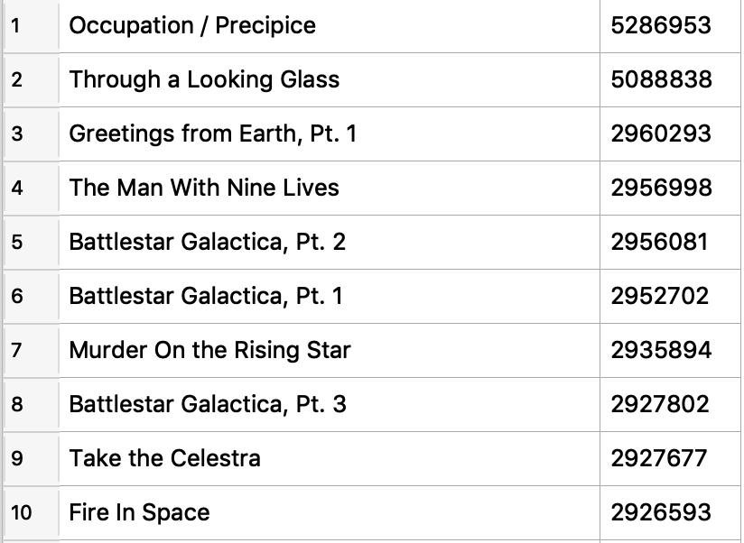

# Projeto 

## Introdução
Neste projeto você irá consultar o banco de dados Chinook. O banco de dados Chinook armazena informações sobre uma loja de música. Para este projeto, você ajudará a equipe Chinook a compreender a mídia em sua loja, seus clientes e funcionários e suas informações de fatura. Para ajudá-lo nas consultas a seguir, o esquema para o banco de dados Chinook é dado abaixo. Você pode ver as colunas que conectam tabelas usando as setas.


### Primeiro Conjunto de Perguntas

#### Pergunta 1: Quais países possuem mais faturas?
Use a tabela Invoice (Fatura) para determinar quais países possuem mais faturas. Forneça as tabelas de BillingCountry (país de cobrança) e Invoices (faturas) ordenadas pelo número de faturas para cada país. O país com mais faturas deve aparecer primeiro.

```
SELECT 
  BillingCountry, 
  count(*) as invoices 
FROM Invoice 
GROUP BY 1 
ORDER BY 2 desc

```

#### Pergunta 2: Qual cidade tem os melhores clientes?
Gostaríamos de lançar um festival de música promocional na cidade que nos gerou mais dinheiro. Escreva uma consulta que retorna a cidade que possui a maior soma dos totais de fatura. Retorne tanto o nome da cidade quanto a soma de todos os totais de fatura.

```
SELECT 
  BillingCity, sum(Total) as invoices 
FROM Invoice 
GROUP BY 1 
ORDER BY 2 DESC 
LIMIT 1
```
#### Pergunta 3: Quem é o melhor cliente?
O cliente que gastou mais dinheiro será declarado o melhor cliente. Crie uma consulta que retorna a pessoa que mais gastou dinheiro. Eu encontrei essa informação ao linkar três tabelas: Invoice (fatura), InvoiceLine (linha de faturamento), e Customer (cliente). Você provavelmente consegue achar a solução com menos tabelas!

```
SELECT 
i.CustomerId, SUM(i.total) as total_spent
FROM Invoice i
GROUP BY 1
ORDER BY 2 DESC
LIMIT 1
```

### Segundo Conjunto de Perguntas

#### Pergunta 1
Use sua consulta para retornar o e-mail, nome, sobrenome e gênero de todos os ouvintes de Rock. Retorne sua lista ordenada alfabeticamente por endereço de e-mail, começando por A. Você consegue encontrar um jeito de lidar com e-mails duplicados para que ninguém receba vários e-mails?

Eu escolhi linkar as informações das tabelas Customer (cliente), Invoice (fatura), InvoiceLine (linha de faturamento), Track (música) e Genre (gênero), mas você pode encontrar outra forma de obter a informação.

Resultado : 59 linhas para o gênero Rock

```
SELECT c.Email, c.FirstName, c.LastName, g.Name
FROM Customer c
JOIN Invoice i ON i.CustomerId = c.CustomerId
JOIN InvoiceLine il ON il.InvoiceId = i.InvoiceId
JOIN Track t ON il.TrackId = t.TrackId
JOIN Genre g ON g.GenreId = t.GenreId
WHERE g.Name = "Rock"
GROUP BY c.Email
```

#### Pergunta 2: Quem está escrevendo as músicas de rock?
Agora que sabemos que nossos clientes amam rock, podemos decidir quais músicos convidar para tocar no show.

Vamos convidar os artistas que mais escreveram as músicas de rock em nosso banco de dados. Escreva uma consulta que retorna o nome do Artist (artista) e a contagem total de músicas das dez melhores bandas de rock.

Você precisará usar as tabelas Genre (gênero), Track (música) , Album (álbum), and Artist (artista).


```
SELECT a.ArtistId, a.name,COUNT(t.trackId) songs
FROM Track as t
JOIN Genre g ON g.GenreId = t.GenreId
JOIN Album ab ON ab.albumId = t.albumId
JOIN Artist a ON a.artistId = ab.artistId
WHERE t.GenreId = g.GenreId and g.Name = "Rock" 
GROUP BY a.ArtistId
ORDER BY COUNT(t.trackId) DESC
LIMIT 10;

```




#### Pergunta 3
Primeiro, descubra qual artista ganhou mais de acordo com InvoiceLines (linhas de faturamento).

Agora encontre qual cliente gastou mais com o artista que você encontrou acima.

Para essa consulta, você precisará usar as tabelas Invoice (fatura), InvoiceLine (linha de faturamento), Track (música), Customer (cliente), Album (álbum) e Artist (artista).

Observe que essa consulta é complicada porque a quantia Total gasta na tabela Invoice (fatura) pode não ser em um só produto, então você precisa usar a tabela InvoiceLine (linha de faturamento) para descobrir quanto de cada produto foi comprado e, então, multiplicar isso pelo preço de cada artista.

```
SELECT a.Name, SUM(il.UnitPrice* il.Quantity) as amountSpent
FROM Invoice i
JOIN InvoiceLine il ON il.InvoiceId = i.InvoiceId
JOIN Track t ON t.TrackId = il.TrackId
JOIN Album ab ON ab.AlbumId = t.AlbumId
JOIN Artist a ON a.ArtistId = ab.ArtistId
GROUP By a.Name
ORDER BY amountSpent DESC

```



Continuação da solução com o maior comprador
Então, os maiores compradores são mostrados na tabela abaixo. O cliente com a maior quantia total em fatura é o cliente 55, Mark Taylor.

```
SELECT a.Name, SUM(il.UnitPrice* il.Quantity) as amountSpent, c.CustomerId, c.FirstName, c.LastName
FROM Invoice i
JOIN InvoiceLine il ON il.InvoiceId = i.InvoiceId
JOIN Track t ON t.TrackId = il.TrackId
JOIN Album ab ON ab.AlbumId = t.AlbumId
JOIN Artist a ON a.ArtistId = ab.ArtistId
JOIN Customer c ON c.CustomerId = i.CustomerId
WHERE a.Name = "Iron Maiden"
GROUP By a.Name, c.CustomerId, c.FirstName, c.LastName
ORDER BY amountSpent DESC

```



### Terceiro Conjunto de Perguntas

#### Pergunta 1

Queremos descobrir o gênero musical mais popular em cada país. Determinamos o gênero mais popular como o gênero com o maior número de compras. Escreva uma consulta que retorna cada país juntamente a seu gênero mais vendido. Para países onde o número máximo de compras é compartilhado retorne todos os gêneros.

Para essa consulta você precisará usar as tabelas Invoice (fatura), InvoiceLine (linha de faturamento), Track (música), Customer (cliente) e Genre (gênero).

```
SELECT SUM(il.Quantity) as Purchases, c.Country, g.GenreId, g.name
FROM Invoice i
JOIN InvoiceLine il ON il.InvoiceId = i.InvoiceId
JOIN Track t ON t.TrackId = il.TrackId
JOIN Customer c ON c.CustomerId = i.CustomerId
JOIN Genre g ON g.GenreId = t.GenreId
WHERE c.Country = 'Argentina'
GROUP By g.GenreId, g.name
ORDER BY c.Country ASC 


WITH  
	popular AS 
    (SELECT SUM(il.Quantity) as Purchases, c.Country, g.GenreId, g.name
      FROM Invoice i
      JOIN InvoiceLine il ON il.InvoiceId = i.InvoiceId
      JOIN Track t ON t.TrackId = il.TrackId
      JOIN Customer c ON c.CustomerId = i.CustomerId
      JOIN Genre g ON g.GenreId = t.GenreId
      GROUP By c.Country, g.GenreId, g.name
	    ORDER BY c.Country
    ),
	  max_popular AS 
      (SELECT MAX(popular.Purchases) as maximo, popular.Country 
        FROM popular 
        GROUP BY popular.Country
      )

SELECT 
  p.Purchases, p.Country, p.name, p.GenreId
  FROM popular p
  JOIN max_popular m ON  m.Country = p.Country
  WHERE p.Purchases = maximo
  ORDER by p.Country

```

#### Pergunta 2

Retorne todos os nomes de músicas que possuem um comprimento de canção maior que o comprimento médio de canção. Embora você possa fazer isso com duas consultas. Imagine que você queira que sua consulta atualize com base em onde os dados são colocados no banco de dados. Portanto, você não quer fazer um hard code da média na sua consulta. Você só precisa da tabela Track (música) para completar essa consulta.

Retorne o Name (nome) e os Milliseconds (milissegundos) para cada música. Ordene pelo comprimento da canção com as músicas mais longas sendo listadas primeiro.

```

SELECT t.Name, t.Milliseconds from Track t
WHERE t.Milliseconds > (SELECT AVG(t.Milliseconds) FROM Track t)
ORDER BY  2 DESC

```




494 rows returned in 5ms from: SELECT t.Name, t.Milliseconds from Track t
WHERE t.Milliseconds > (SELECT AVG(t.Milliseconds) FROM Track t)
ORDER BY  2 DESC

#### Pergunta 3
Escreva uma consulta que determina qual cliente gastou mais em músicas por país. Escreva uma consulta que retorna o país junto ao principal cliente e quanto ele gastou. Para países que compartilham a quantia total gasta, forneça todos os clientes que gastaram essa quantia.

Você só precisará usar as tabelas Customer (cliente) e Invoice (fatura).

```

WITH  
	spent_per_contry AS 
    (SELECT c.Country, SUM(il.UnitPrice* il.Quantity) as TotalSpent, c.firstName, c.lastName, i.CustomerId
      FROM Invoice i
      JOIN InvoiceLine il ON il.InvoiceId = i.InvoiceId
      JOIN Track t ON t.TrackId = il.TrackId
      JOIN Customer c ON c.CustomerId = i.CustomerId
      JOIN Genre g ON g.GenreId = t.GenreId
      GROUP By c.Country, c.firstName, c.lastName, i.CustomerId
      ORDER BY 2, 1 DESC 
    ),
	  max_spent AS 
      (SELECT MAX(s.TotalSpent) as maximo,s.Country
        FROM spent_per_contry s 
        GROUP BY s.Country
      )

SELECT 
  sp.TotalSpent, ms.maximo, sp.Country, sp.firstName, sp.lastName, sp.CustomerId
  FROM spent_per_contry sp
  JOIN max_spent ms ON  ms.Country = sp.Country
  WHERE sp.TotalSpent = ms.maximo
  ORDER by sp.Country

```