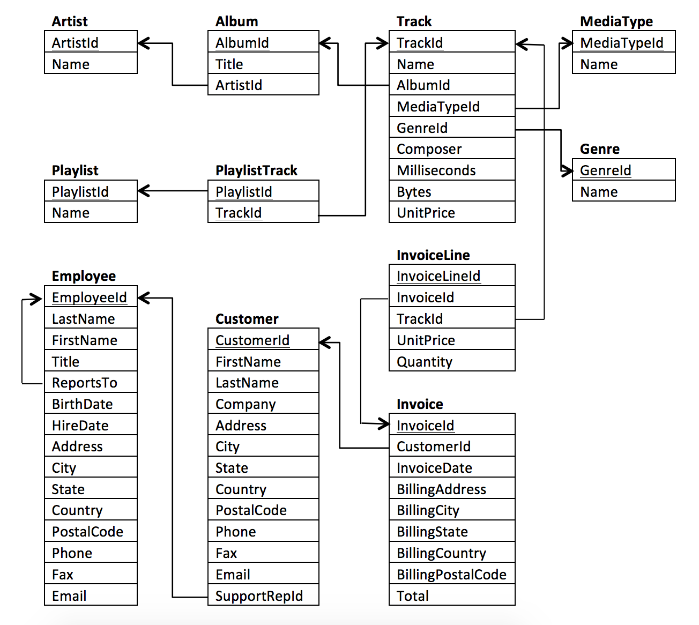

# Projeto 

## Introdução
Neste projeto você irá consultar o banco de dados Chinook. O banco de dados Chinook armazena informações sobre uma loja de música. Para este projeto, você ajudará a equipe Chinook a compreender a mídia em sua loja, seus clientes e funcionários e suas informações de fatura. Para ajudá-lo nas consultas a seguir, o esquema para o banco de dados Chinook é dado abaixo. Você pode ver as colunas que conectam tabelas usando as setas.



### Primeiro Conjunto de Perguntas

#### Pergunta 1: Quais países possuem mais faturas?
Use a tabela Invoice (Fatura) para determinar quais países possuem mais faturas. Forneça as tabelas de BillingCountry (país de cobrança) e Invoices (faturas) ordenadas pelo número de faturas para cada país. O país com mais faturas deve aparecer primeiro.

```
SELECT 
  BillingCountry, 
  count(*) as invoices 
FROM Invoice 
GROUP BY 1 
ORDER BY 2 desc

```

#### Pergunta 2: Qual cidade tem os melhores clientes?
Gostaríamos de lançar um festival de música promocional na cidade que nos gerou mais dinheiro. Escreva uma consulta que retorna a cidade que possui a maior soma dos totais de fatura. Retorne tanto o nome da cidade quanto a soma de todos os totais de fatura.

```
SELECT 
  BillingCity, sum(Total) as invoices 
FROM Invoice 
GROUP BY 1 
ORDER BY 2 DESC 
LIMIT 1
```
#### Pergunta 3: Quem é o melhor cliente?
O cliente que gastou mais dinheiro será declarado o melhor cliente. Crie uma consulta que retorna a pessoa que mais gastou dinheiro. Eu encontrei essa informação ao linkar três tabelas: Invoice (fatura), InvoiceLine (linha de faturamento), e Customer (cliente). Você provavelmente consegue achar a solução com menos tabelas!

```
SELECT 
i.CustomerId, SUM(i.total) as total_spent
FROM Invoice i
GROUP BY 1
ORDER BY 2 DESC
LIMIT 1
```

### Segundo Conjunto de Perguntas

#### Pergunta 1
Use sua consulta para retornar o e-mail, nome, sobrenome e gênero de todos os ouvintes de Rock. Retorne sua lista ordenada alfabeticamente por endereço de e-mail, começando por A. Você consegue encontrar um jeito de lidar com e-mails duplicados para que ninguém receba vários e-mails?

Eu escolhi linkar as informações das tabelas Customer (cliente), Invoice (fatura), InvoiceLine (linha de faturamento), Track (música) e Genre (gênero), mas você pode encontrar outra forma de obter a informação.

Resultado : 59 linhas para o gênero Rock

```
SELECT c.Email, c.FirstName, c.LastName, g.Name
FROM Customer c
JOIN Invoice i ON i.CustomerId = c.CustomerId
JOIN InvoiceLine il ON il.InvoiceId = i.InvoiceId
JOIN Track t ON il.TrackId = t.TrackId
JOIN Genre g ON g.GenreId = t.GenreId
WHERE g.Name = "Rock"
GROUP BY c.Email
```

#### Pergunta 2: Quem está escrevendo as músicas de rock?
Agora que sabemos que nossos clientes amam rock, podemos decidir quais músicos convidar para tocar no show.

Vamos convidar os artistas que mais escreveram as músicas de rock em nosso banco de dados. Escreva uma consulta que retorna o nome do Artist (artista) e a contagem total de músicas das dez melhores bandas de rock.

Você precisará usar as tabelas Genre (gênero), Track (música) , Album (álbum), and Artist (artista).


